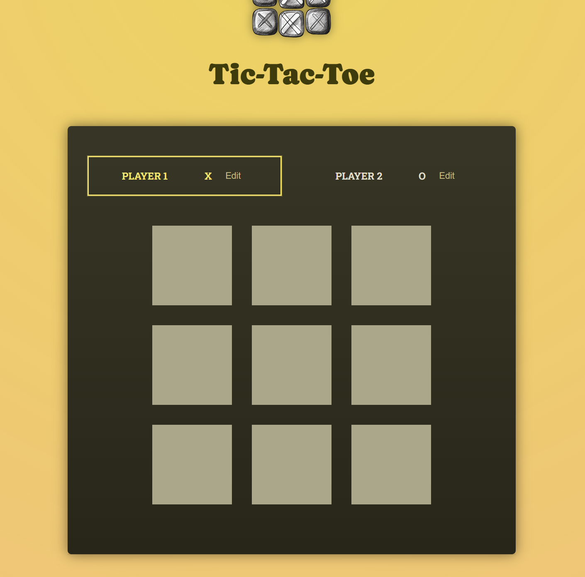
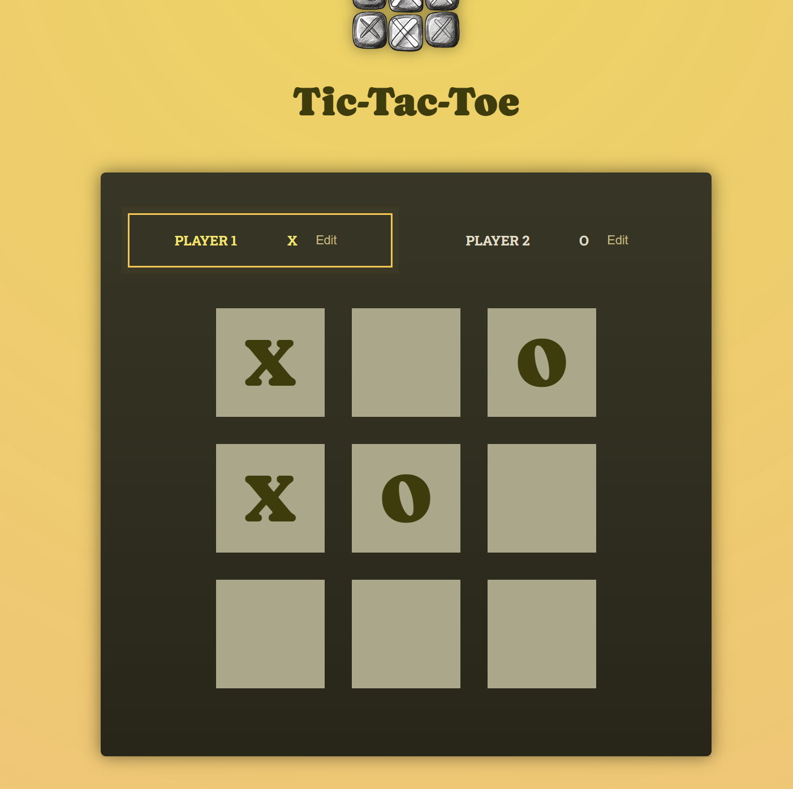
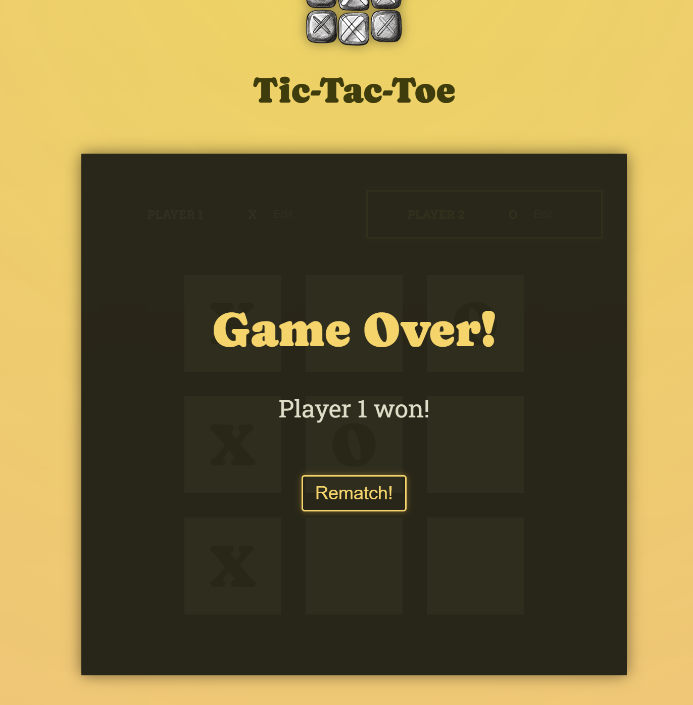

# 🎮 Tic-Tac-Toe

A modern implementation of the classic Tic-Tac-Toe game built with **React** and **Vite**, focusing on clean architecture, state derivation, and component-driven design.

## 🚀 Live Demo

[https://tic-tac-toe-cyan-xi.vercel.app](https://tic-tac-toe-cyan-xi.vercel.app)



---

## 🧠 Key Features

* ⚛️ Built with **React 19**
* ⚡ Fast development using **Vite**
* 🎯 Derived state (no redundant state storage)
* 🔄 Game state reconstruction from history
* 🧩 Modular component architecture
* ✏️ Editable player names
* 📜 Move history log
* 🏆 Winner detection logic
* 🤝 Draw detection
* 🔁 Game restart functionality

### Screenshots


*Gameplay in progress*



*Winner detection example*

---

## 🏗️ Architecture Highlights

### 1. Derived State Pattern

Instead of storing everything in state, the app derives:

* active player
* game board
* winner

```js
const activePlayer = deriveActivePlayer(gameTurns);
const gameBoard = deriveGameBoard(gameTurns);
const winner = deriveWinner(gameBoard, players);
```

This reduces bugs and keeps state minimal.

---

### 2. Game State as History

All moves are stored as:

```js
[
  { square: { row: 0, col: 1 }, player: "X" },
  ...
]
```

From this, the entire UI is reconstructed.

---

### 3. Pure Functions for Logic

Game logic is extracted into pure functions:

* `deriveActivePlayer`
* `deriveGameBoard`
* `deriveWinner`

This makes the logic:

* testable
* predictable
* reusable

---

## 🧱 Tech Stack

* **React**
* **Vite**
* **JavaScript (ES6+)**
* **ESLint**

---

## 📁 Project Structure

```
src/
 ├── components/
 │   ├── Player.jsx
 │   ├── GameBoard.jsx
 │   ├── GameOver.jsx
 │   └── Log.jsx
 ├── App.jsx
 └── winning-combinations.js
```

---

## ⚙️ Getting Started

### 1. Clone the repository

```bash
git clone https://github.com/vasylpryimakdev/tic-tac-toe.git
cd tic-tac-toe
```

### 2. Install dependencies

```bash
npm install
```

### 3. Run development server

```bash
npm run dev
```

---

## 📜 Available Scripts

```bash
npm run dev      # start dev server
npm run build    # build for production
npm run preview  # preview production build
npm run lint     # run ESLint
```

---

## 🎯 What I Learned

* Managing **derived vs stored state**
* Designing **pure functions for business logic**
* Structuring React apps for **scalability**
* Avoiding unnecessary re-renders
* Building UI from **state history**

---

## 🔥 Possible Improvements

* Add **AI opponent**
* Add **online multiplayer (WebSockets)**
* Add **animations**
* Add **score tracking**
* Persist game state (localStorage)

---

## 👨‍💻 Author

Vasyl Pryimak

---
